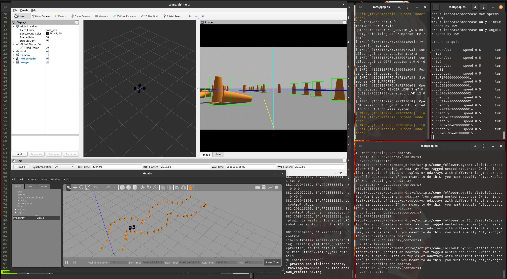

# Cone Following with Ackermann Drive

This repo has the code for a ackermann drive bot to follow cones.
The project is incomplete in the sense that while the perception and planning
algorithm is complete, the software control loop needs work.

Before using copy the "good\_cone" model from the models folder to
`~/.gazebo/models`.

I will link all the repos used for this project soon.

